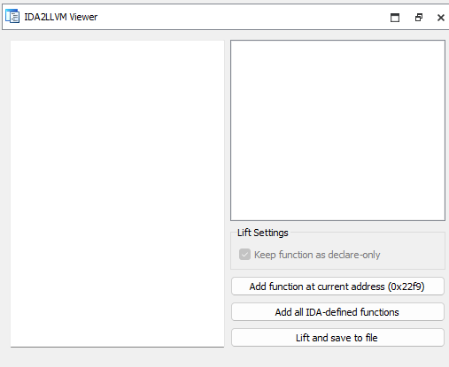
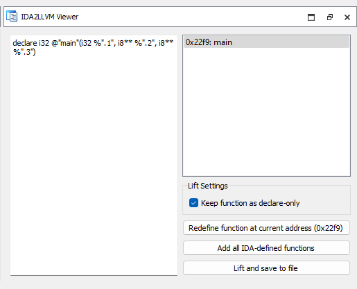
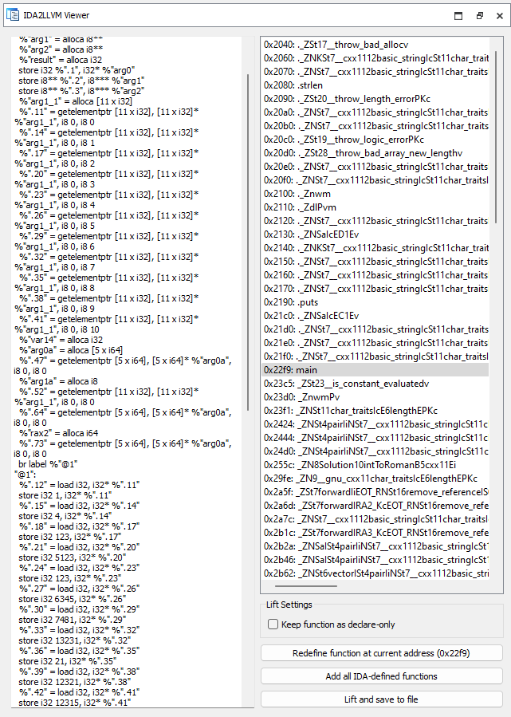
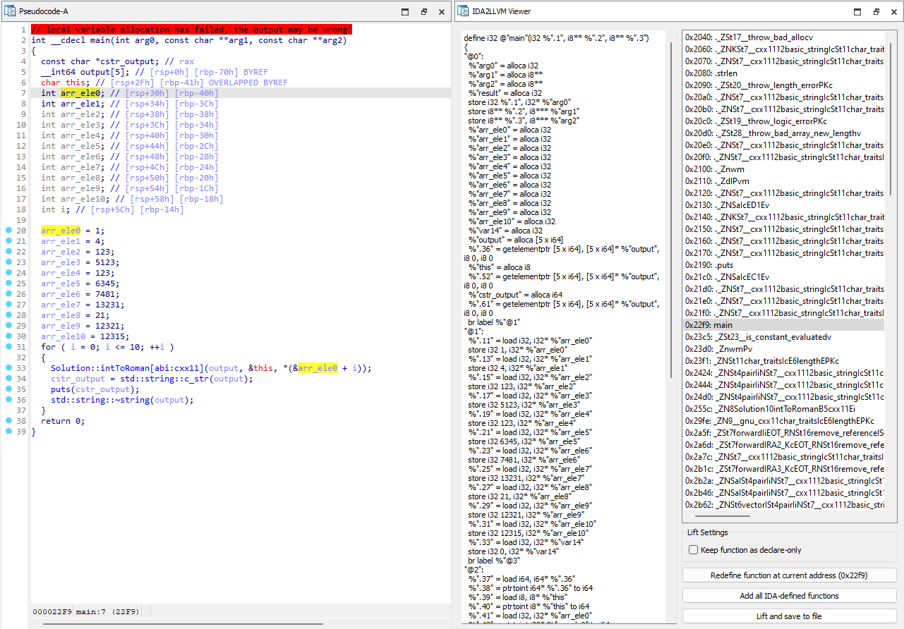
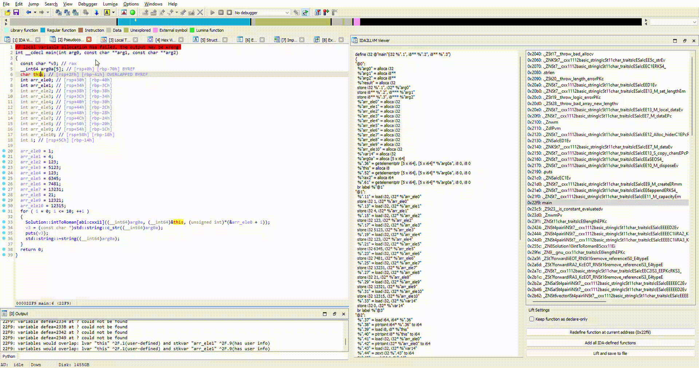

# IDA2LLVM - Dynamic Binary Lifting IDA code to LLVM IR

Because I was curious, "can Hexrays decompilation be hijacked for LLVM lifting"?


## Features

1. Lifts all IDA-decompilable binaries to LLVM bitcode, including executables and shared libraries for each platform.
2. **guarantees CFG preservation** during lifting
3. enable **interactive lifting**, for reverse-engineers most familiar with state-of-the-art IDA

## Dependencies
| Name | Version | 
| ---- | ------- |
| [Python](https://www.python.org/) | 3.10* |
| [llvmlite](https://pypi.org/project/llvmlite/) | 0.39.1* |
| [headless-ida](https://pypi.org/project/headless-ida/)** | 0.5.2 |
| [pytest](https://pypi.org/project/pytest/)** | 7.4.3 |
| [IDA Pro](https://www.hex-rays.com/products/ida) | 7.7+ |

*llvmlite 0.39.1 did not have wheels for Python 3.11+  
**only needed for unittests

## Using the lifter

### Run as IDA Plugin

IDA2LLVM will load for any architecture with a Hex-Rays decompiler present. Use the hot-key (Ctrl+Alt+L) or <ins>Edit/IDA2LLVM/Lifting Viewer</ins> to open the Lifting Viewer.



Lifting is performed at IDA's **function** level (assuming Microcode can be emitted). The viewer will always synchronize against the user's cursor in the disassembly window, indicating whether it can be lifted.



Having added a function, we can select it in the panel. Here we can: 
1. unmark function as declare-only
    - the main gruntwork is done here, providing function definition.
    - children function are recursively lifted, with declare-only unmarked.
2. redefine the function
   - lifting is performed on a per-demand basis.
   - if there are changes to decompiler, we should redefine the function.
3. delete function, with `Del` key

An example of a fully defined main function is as such:



### Interactive lifting

> More often than not, lifting will not work out of the box. A key feature of IDA2LLVM is interactive lifting. 

Let's look `tests/bin/romannumeral.out`. Variable names have been renamed appropriately:



Pay attention to `arr_eleX` variables. 
- Hexray's decompiler has displayed these as individual stack variables,
- however, the line `*(&arr_ele0 + i)` betrays the fact that it is an array of integers `{1, 4, 123, 5123...}` of size 11.

Our lifted output will be faithful to Hexray's decompiler. Each integer variable will be an indepedent stack variable, and the line `*(&arr_ele0 + i)` will result in an memory access error.



We can fix this issue by appropriately defining the types in the decompiler, and redefining the function. All work has been done and saved in `tests/idb/romannumeral.i64`.

### Run in Docker

> This works mostly as a convenience tool. We sacrifice **the entire capability for a reverse engineer to interactively lift**, hence accuracy is severely diminished.

This requires an IDA Pro Windows installation.

Our Dockerfile runs Windows IDA Pro in a Linux container, emulating it in Wine. 

#### Step 1: Clone the repository

```pwsh
git clone https://github.com/loyaltypollution/ida2llvm
```

#### Step 2: Add `ida.tar` to `.devcontainer/dep`

Insert a tar zip of the entire IDA Pro folder 
```pwsh
tar cvf ida.tar "$(dirname "$(which ida64)")"
```

#### Step 3: Build & Run Dockerfile

Insert the idb in the directory 

```pwsh
docker build . -t bin2llvm
docker run --rm -it -v .\tests:/home/bin2llvm/tests bin2llvm
```

## Linking Notes

Suppose the user lifted all functions in the idb. This potentially includes symbols from the C standard library, such as `_start`.

Naievely compiling from `clang` will likely result in link issues. Common issues include:
- duplicate symbols
- undefined symbols

In general, link issues are not our concern. Our lifter has already done its work and it's up to the user to fix linking issues *(good luck)*. 

Here are some tips to fix linking issues:
- instruct the linker to use the first symbol seen (`allow-multiple-definition`)
    ```bash
        clang lifted.ll -c
        clang lifted.o -v -Wl,--allow-multiple-definition -o lifted.out
    ```

*please raise an issue and let the author learn more about cpp linking*